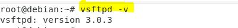
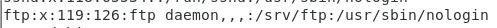
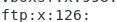
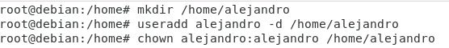
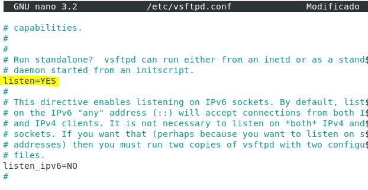
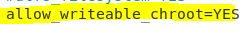
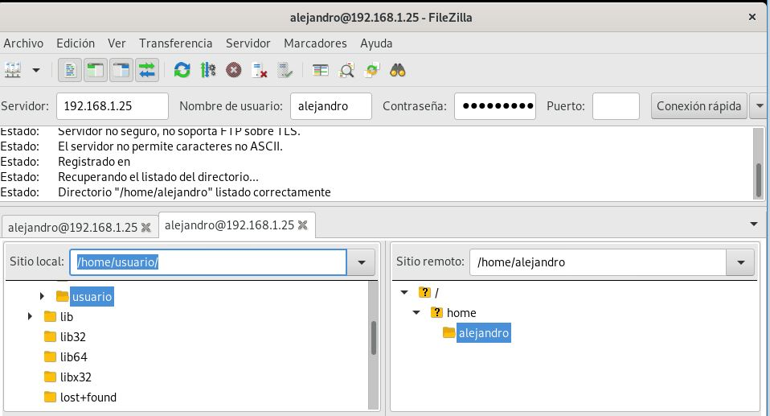
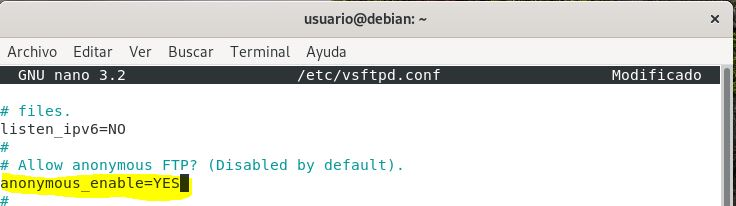
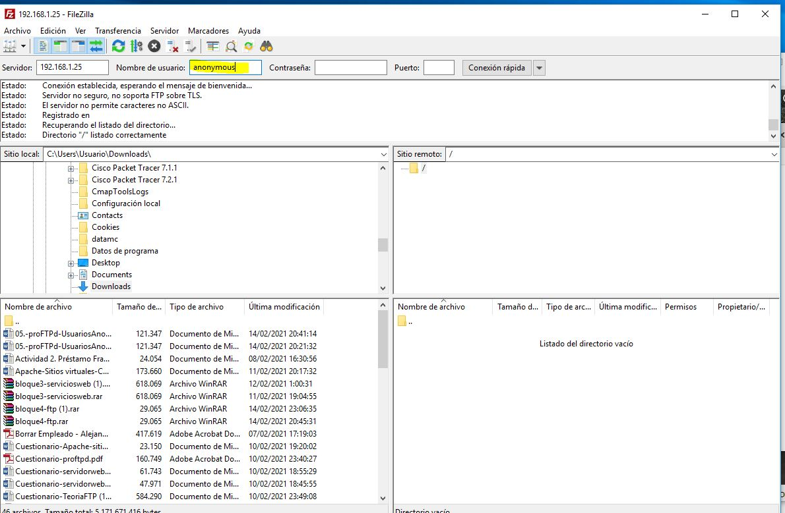
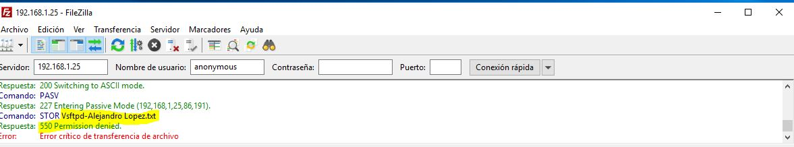

### A) Version Instalada
 
### B) Usuarios Creados en la Instalación
Vamos a ver que usuarios y grupos se han creado.
Con el comando:  
```
$ cat /etc/passwd
```
Vemos que se ha creado:  
  
Con el comando:  
```
$ cat /etc/group
```
vemos que se ha creado:  
  
### C) Servicio Asociado
* El servicio es vsftpd.service
```
$ systemctl status vsftpd
```
```
$ systemctl restart vsftpd
```
```
$ systemctl stop vsftpd
```
### D) Ficheros de Configuración
El fichero de configuracion se encuentra en /etc y es:
```
/etc/vsftpd.conf
```
Las directivas mas importantes son:
- **local_enable** = Al estar activada, los usuarios locales pueden conectarse al sistema.
- **anon_root** = Especifica el directorio al cual vsftpd cambia luego que el usuario anónimo se conecta.
- **ftp_username** = Especifica la cuenta del usuario local (listada en /etc/passwd) utilizada por el usuario FTP anónimo. El directorio principal especificado en /etc/passwd para el usuario es el directorio raíz del usuario FTP anónimo.
- **chmod_enable** = Cuando está activada, se permite el comando FTP SITE CHMOD para los usuarios locales. Este comando permite que los usuarios cambien los permisos en los archivos.
- **chroot_list_enable** = Cuando está activada, se coloca en una prisión de chroot a los usuarios locales listados en el archivo especificado en la directriz chroot_list_file.
- **chroot_local_user** = Si está activada, a los usuarios locales se les cambia el directorio raíz (se hace un chroot) a su directorio principal luego de la conexión.
- **local_umask=022** = Esta directiva nos permite habilitar los permisos nuevos cuando copiemos datos al servidro FTP, por defecto el umask es 077 pero podremos modificarlo por el valor que nosotros queramos, 022 es el umask más utilizado en otros servidores FTP.  
- **[Todas las Directivas](https://web.mit.edu/rhel-doc/4/RH-DOCS/rhel-rg-es-4/s1-ftp-vsftpd-conf.html)**
### E) Acceso al servidor FTP: usuarios del sistema
Antes de empezar nos crearemos un nuevo usuario y le cambiaremos los permisos  
  
Tambien cambiaremos la contraseña  
```
passwd alejandro
```
Le damos permisos  
```
chmod -R 777 /etc/alejandro
```
Ahora tocaremos el fichero de configuración de vsftpd.conf, pondremos listen en modo YES  
  
 Y añadiremos la siguiente linea  
   
 - Finalmente nos conectamos desde filezilla  
  
### F) Acceso al servidor FTP: anónimo tiene solo permiso de lectura en su directorio de trabajo 
Vamos a editar el fichero /etc/vsftpd.conf. Cambiamos la siguiente linea a YES. Para permitir acceder como usuario anonimo.    

     
   
Luego reiniciamos el servicio
```
systemctl restart vsftpd
```
Y desde filezilla hacemos las comprobaciones.
Primero nos conectamos.  
  
  
    
 
Intentamos subir un archivo, y como vemos no nos deberia dejar.  
  
  
### G) Acceso al servidor FTP: anónimo tiene permiso de escritura en el directorio sugerencias, que es un subdirectorio de su directorio raíz.
### H) Acceso al servidor FTP: Creación de usuarios virtuales.
### I) Acceso seguro al servidor FTP
